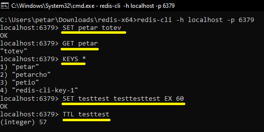

# PT_Demo_Redis

PT_Demo_Redis is a demo that uses Redis and Redlock in a .NET Web API.

## Contents

- [Docker Redis + Redis CLI](#docker-redis--redis-cli)
    - [Docker Redis](#docker-redis)
    - [Redis CLI](#redis-cli)
- [Demo Redis + Redlock](#demodkredisredlock)
    - [Prerequisites](#prerequisites)
    - [Redis Implementation](#redis-implementation)
    - [Redlock Implementation](#redlock-implementation)
- [Links](#links)

## Docker Redis + Redis CLI

### Docker Redis

1. Find the existing `docker-compose.yaml` file in `/DemoPetarRedis`:

```
version: '3.8'
services:
  redis:
    image: redis
    container_name: redis_api
    ports:
    - "6379:6379"
```

2. Run the Redis Docker container by using the `docker-compose.yaml` file`and by running the following command from the same directory:

```
docker compose up -d
```

### Redis CLI

1. Download latest `Redis-x64.zip` from https://github.com/microsoftarchive/redis/releases and extract it.

2. Next, in the extracted directory, open a new CMD prompt.

3. Finally, run `redis-cli` command and experiment with it:



## DemoDkRedisRedlock 

### Prerequisites

1. Create new empty .NET Solution

2. Create new .NET 8 Web API Project in the solution

3. Install the following NuGet packages:

```
dotnet add package Microsoft.Extensions.Caching.StackExchangeRedis --version 8.0.7
dotnet add package RedLock.net --version 2.3.2
```

### Redis Implementation

### Redlock Implementation

## Links
- https://github.com/samcook/RedLock.net
- https://github.com/microsoftarchive/redis/releases